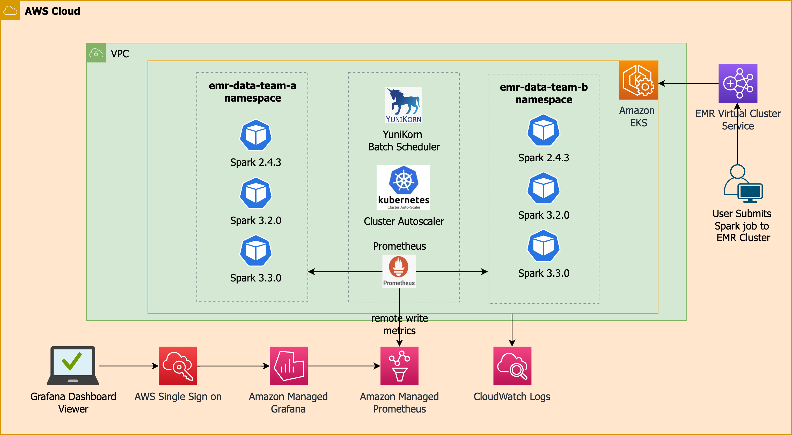

# Apache YuniKorn with EMR on EKS

## Introduction
In this post, we learn how to deploy highly scalable EMR on EKS Clusters with [Apache YuniKorn](https://yunikorn.apache.org/) batch scheduler and Cluster Autoscaler.

Apache YuniKorn is designed to run Batch workloads on Kubernetes.

Key features as follows...

1. Application-aware scheduling
2. Fine-grained control over resources for different tenants
3. Job ordering and queueing
4. Resource allocation fairness with priorities
5. Automatic reservations for outstanding requests
6. Autoscaling
7. Gang Scheduling Spark jobs

## Architecture


## Deploying the Solution

In this [example](https://github.com/awslabs/data-on-eks/tree/main/analytics/terraform/emr-eks-yunikorn), you will provision the following resources required to run Spark Jobs using EMR on EKS, as well as monitor spark job metrics using **Amazon Managed Prometheus** and **Amazon Managed Grafana**.

- Creates EKS Cluster Control plane with public endpoint (for demo purpose only)
- Three managed node groups
  - Core Node group with 3 AZs for running system critical pods. e.g., Cluster Autoscaler, CoreDNS, Observability, Logging etc.
  - Spark Driver Node group with ON_DEMAND instances for Spark Drivers with single AZ
  - Spark Executor Node group with SPOT instances for Spark Executors with single AZ
- Enable EMR on EKS and creates two Data teams (`emr-data-team-a`, `emr-data-team-b`)
  - Creates new namespace for each team
  - Creates Kubernetes role and role binding(`emr-containers` user) for the above namespace
  - New IAM role for the team execution role
  - Update AWS_AUTH config map with  emr-containers user and AWSServiceRoleForAmazonEMRContainers role
  - Create a trust relationship between the job execution role and the identity of the EMR managed service account
- EMR Virtual Cluster and IAM policy for `emr-data-team-a` and `emr-data-team-b`
- Amazon Managed Prometheus workspace to remote write metrics from Prometheus server
- Deploys the following Kubernetes Add-ons
    - Managed Add-ons
        - VPC CNI, CoreDNS, KubeProxy, AWS EBS CSi Driver
    - Self Managed Add-ons
        - Apache YuniKorn, Metrics server with HA, CoreDNS Cluster proportional Autoscaler, Cluster Autoscaler, Prometheus Server and Node Exporter, VPA for Prometheus, AWS for FluentBit, CloudWatchMetrics for EKS

### Prerequisites:

Ensure that you have installed the following tools on your machine.

1. [aws cli](https://docs.aws.amazon.com/cli/latest/userguide/install-cliv2.html)
2. [kubectl](https://Kubernetes.io/docs/tasks/tools/)
3. [terraform](https://learn.hashicorp.com/tutorials/terraform/install-cli)

_Note: Currently Amazon Managed Prometheus supported only in selected regions. Please see this [userguide](https://docs.aws.amazon.com/prometheus/latest/userguide/what-is-Amazon-Managed-Service-Prometheus.html) for supported regions._

### Deploy

Clone the repository

```bash
git clone https://github.com/awslabs/data-on-eks.git
```

Navigate into one of the example directories and run `terraform init`

```bash
cd analytics/terraform/emr-eks-yunikorn
terraform init
```

Set `AWS_REGION` and Run Terraform plan to verify the resources created by this execution.

```bash
export AWS_REGION="us-west-2" # Change region according to your needs.
terraform plan
```

Deploy the pattern

```bash
terraform apply
```

Enter `yes` to apply.

## Verify the resources

Let’s verify the resources created by `terraform apply`.

Verify the Amazon EKS Cluster and Amazon Managed service for Prometheus.

```bash
aws eks describe-cluster --name emr-eks-yunikorn

aws amp list-workspaces --alias amp-ws-emr-eks-yunikorn
```

Verify EMR on EKS Namespaces `emr-data-team-a` and `emr-data-team-b` and Pod status for `Prometheus`, `Vertical Pod Autoscaler`, `Metrics Server` and `Cluster Autoscaler`.

```bash
aws eks --region <ENTER_YOUR_REGION> update-kubeconfig --name emr-eks-yunikorn # Creates k8s config file to authenticate with EKS Cluster

kubectl get nodes # Output shows the EKS Managed Node group nodes

kubectl get ns | grep emr-data-team # Output shows emr-data-team-a and emr-data-team-b namespaces for data teams

kubectl get pods --namespace=prometheus # Output shows Prometheus server and Node exporter pods

kubectl get pods --namespace=vpa  # Output shows Vertical Pod Autoscaler pods

kubectl get pods --namespace=kube-system | grep  metrics-server # Output shows Metric Server pod

kubectl get pods --namespace=kube-system | grep  cluster-autoscaler # Output shows Cluster Autoscaler pod
```

### Setup Amazon Managed Grafana with SSO
Currently, this step is manual. Please follow the steps in this [blog](https://aws.amazon.com/blogs/mt/monitoring-amazon-emr-on-eks-with-amazon-managed-prometheus-and-amazon-managed-grafana/) to create Amazon Managed Grafana with SSO enabled in your account.
You can visualize the Spark jobs runs and metrics using Amazon Managed Prometheus and Amazon Managed Grafana.

## Execute EMR Spark Job with Apache YuniKorn Gang Scheduling
Execute the Spark job using the below shell script.

- This script requires three input parameters in which `EMR_VIRTUAL_CLUSTER_ID` and `EMR_JOB_EXECUTION_ROLE_ARN` values can be extracted from `terraform apply` output values.
- For `S3_BUCKET`, Either create a new S3 bucket or use an existing S3 bucket to store the scripts, input and output data required to run this sample job.

```text
EMR_VIRTUAL_CLUSTER_NAME=$1   # Terraform output variable is `emrcontainers_virtual_cluster_name`
S3_BUCKET=$2                  # This script requires s3 bucket as input parameter e.g., s3://<bucket-name>
EMR_JOB_EXECUTION_ROLE_ARN=$3 # Terraform output variable is `emr_on_eks_role_arn`
```
:::caution

This shell script downloads the test data to your local machine and uploads to S3 bucket. Verify the shell script before running the job.

:::

```bash
cd analytics/terraform/emr-eks-yunikorn/examples/emr-yunikorn-gang-scheduling/

# Execute EMR Spark Job with Apache YuniKorn Gang Scheduling feature
./emr-eks-yunikorn-gang-scheduling.sh emr-eks-yunikorn-emr-data-team-a s3://<S3_BUCKET_NAME> arn:aws:iam::<YOUR_ACCOUNT_ID>:role/emr-eks-yunikorn-emr-eks-data-team-a

```

Verify the job execution

```bash
kubectl get pods --namespace=emr-data-team-a -w
```

## Cleanup

To clean up your environment, destroy the Terraform modules in reverse order with `--target` option to avoid destroy failures.

Destroy the Kubernetes Add-ons, EKS cluster with Node groups and VPC

```bash
terraform destroy -target="module.eks_blueprints_kubernetes_addons" -auto-approve
terraform destroy -target="module.eks_blueprints" -auto-approve
terraform destroy -target="module.vpc" -auto-approve
```

Finally, destroy any additional resources that are not in the above modules

```bash
terraform destroy -auto-approve
```
:::caution

To avoid unwanted charges to your AWS account, delete all the AWS resources created during this deployment
:::
