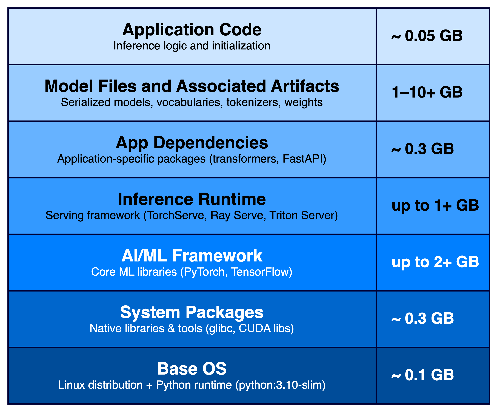

# Solving cold start challenges for AI/ML inference applications on Amazon EKS

:::info
This guide will get regular updates based on observed patterns. New content might be added, and existing might be changed.
:::

## The cold start challenge

Containerizing AI/ML inference applications allows organizations to leverage Kubernetes's automated scaling to handle fluctuating demand, unified resource orchestration to manage expensive GPU hardware, and declarative configuration to simplify their deployment pipelines and operations.

While Kubernetes offers a lot of benefits to make running applications easier, application cold start is still a challenge.

Although acceptable startup times differ between AI/ML inference applications, delays of tens of seconds to several minutes create cascading effects throughout the system, impacting user experience, application performance, operational efficiency, infrastructure costs, and time-to-market.

Key impacts include:

- Increased request latency and degraded user experience
- Idle expensive GPU resources
- Reduced responsiveness of auto-scaling processes during traffic spikes
- Long feedback loops during deployment, experimentation, testing and debugging

To effectively evaluate and implement the solutions in this guide, it is important to outline, and later explore further, several compounding factors that contribute to application container startup time:

- Provision and bootstrapping of the compute capacity (e.g., Amazon EC2 instances) to host the application
- Downloading of the typically large container images and model artifacts

The rest of the guide explores recommended patterns and solutions for these factors for applications deployed on Amazon Elastic Kubernetes Service (Amazon EKS).

Each solution provides an implementation guide covering the following aspects:

- In-depth discussion of the recommended AWS and Kubernetes architecture
- Implementation details, along with code examples
- Ways in which it benefits the main purpose
- Any potential additional benefits and integrations with other solutions
- Trade-offs to take into account

## Improving container startup time

Container image pull time is a primary contributor to the startup latency of AI/ML inference applications. These applications may reach sizes of multiple gigabytes due to inclusion of framework dependencies (e.g., PyTorch or TensorFlow), runtimes (e.g., TorchServe, Triton or Ray Serve), and bundled model files and associated artifacts.

In this section we will focus on the following solutions:

- reducing the overall size of the image
- making the container image pull process more efficient

As we explore the solutions and their tradeoffs, we will refer to various layers and components that go into creating an AI/ML inference application container as depicted in the diagram in Figure 1.

Figure 1: An AI/ML inference application container image layers

Note that lower layers in the diagram may already contain artifacts from higher layers (e.g., PyTorch AI/ML framework and inference runtime components bundled in the pytorch/pytorch base OS image and not installed separately), which can either simplify or complicate optimization.
