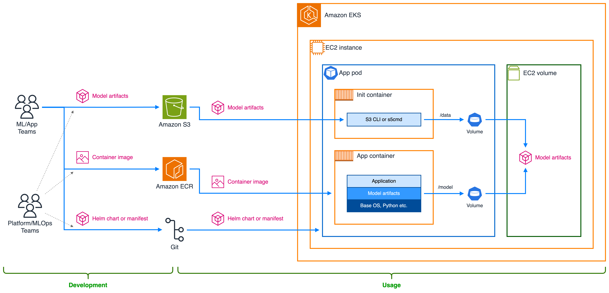
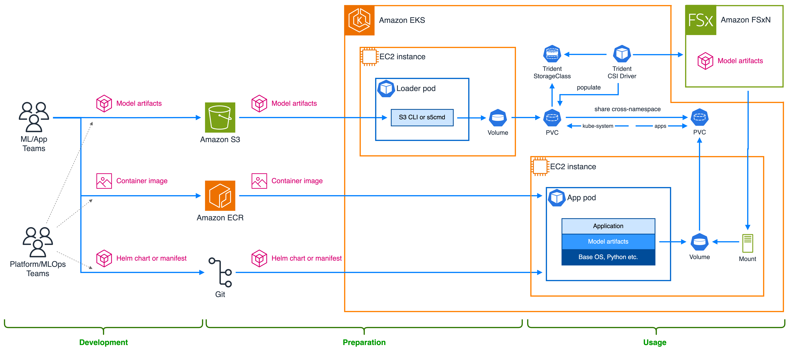
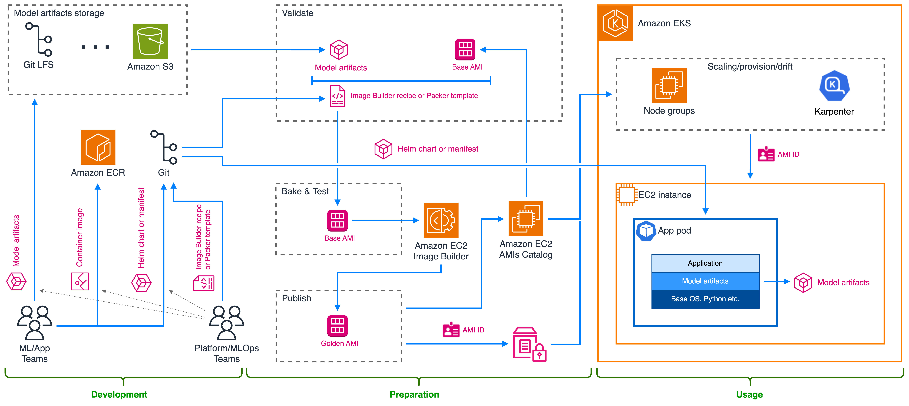

# Decoupling model artifacts from container image

While the main purpose of extracting model artifacts is to reduce the container image size, this approach also provides additional operational and functional advantages. The operational improvements include separate versioning, streamlined auditing, and lifecycle control for model artifacts, while lazy-loading, hot-swapping, and reuse across different applications offer additional functional flexibility and performance. Depending on the use case these advantages can be decisive factors when selecting among the solutions outlined in this section.

## Using init containers to download model artifacts from Amazon S3

This solution provides a straightforward approach to extracting any model files or associated artifacts to an external storage. The artifacts are tagged, versioned and placed in an Amazon S3 bucket during the development or CI/CD phases, along with the appropriate lifecycle policy to control their retention. Once referenced by an application, they are downloaded to shared volumes during the application’s pod initialization using the Kubernetes native [init containers](https://kubernetes.io/docs/concepts/workloads/pods/init-containers/), which are executed sequentially before the main application container.

**Architecture overview**

The diagram in Figure 1 shows the architecture for the solution, which includes the personas, AWS services, Kubernetes components, and artifacts that are being created, stored and retrieved as part of the data flow.


*Figure 1: Init containers architecture to retrieve model artifacts from Amazon S3*

**Implementation guide**

Following the architecture diagram above, these are the main high-level steps for each of the teams.

The DevOps/MLOps/Platform team:

1. alters the Kubernetes deployment manifest (e.g., YAML files, Helm charts) to include init containers, 
2. implements, using the init containers that are executed first, the steps to download model artifacts to an EC2 volume
3. alters the Kubernetes deployment manifests to:
    1. define a volume shared between init containers and the application container 
    2. mount the volume under the expected paths in the application container
4. adjusts pod IAM permissions to allow init containers to access the appropriate prefix in the bucket
5. creates an Amazon S3 bucket to store model artifacts
6. alters the container image definition to exclude the model artifacts during the build stage


ML or application teams:

1. upload model artifacts to an Amazon S3 bucket (as part of their SDLC)
2. continue to push their container image changes to Amazon ECR, as before
3. continue to use the Kubernetes deployment manifests to define the application Kubernetes deployment, as before


The following code shows an already-adjusted Kubernetes deployment manifest:

```
apiVersion: apps/v1
kind: Deployment
metadata:
  name: my-inference-app
  namespace: apps
spec:
  selector:
    matchLabels:
      app.kubernetes.io/name: my-inference-app
  replicas: 1
  template:
    metadata:
      labels:
        app.kubernetes.io/name: my-inference-app
    spec:
      serviceAccountName: my-inference-app
      initContainers:
        - name: download
          image: peakcom/s5cmd
          command:
            - /bin/sh
            - -c
            - '/s5cmd sync s3://my-ml-bucket/model-artifacts/my-model-1.2.3/* /model-artifacts/my-model-1.2.3'
          resources:
            ...
          volumeMounts:
            - mountPath: /model-artifacts
              name: model-artifacts
      containers:
        - name: app
          image: <account-id>.dkr.ecr.<region>.amazonaws.com/my-inference-app:3.5.0
          ports:
            - name: app-port
              containerPort: 6060
          resources:
            ...
          volumeMounts:
            - mountPath: /app/model-artifacts
              name: model-artifacts
      volumes:
        - emptyDir: {}
          name: model-artifacts
```

The example above follows the steps outlined above and uses [s5cmd](https://github.com/peak/s5cmd), which is an open-source tool that provides [excellent performance](https://github.com/peak/s5cmd/blob/master/README.md#Benchmarks) for downloading files from Amazon S3. The implementation relies on the fact that the current, everything-in-image solution bundles the `my-model-1.2.3` model artifacts in the container image under the `/app/model-artifacts` and mimics that behavior by placing them in the same location.

Note that the `my-inference-app` service account listed in the manifest above needs to have the appropriate IAM permissions to read from the corresponding prefix in the `my-ml-bucket` bucket. On Amazon EKS, the recommended way to achieve that is to use [Amazon EKS Pod Identity add-on](https://docs.aws.amazon.com/eks/latest/userguide/pod-identities.html). Amazon EKS Pod Identity provides a way to create, via the AWS API, an association between a Kubernetes service account and an AWS IAM role. When deployed, Pod Identity add-on places an agent (via DaemonSet) on every node in the cluster. and then allows pods with that service account to extract the required credentials, at runtime, from that agent.

**Main benefits**

This solution implements the high-level approach of improving AI/ML inference application containers startup performance by reducing the container image size. Depending on networking conditions, and `s5cmd` superior performance, it may also improve the image pull directly.

**Additional benefits**

In addition to the main benefit, the solution introduces the following potential additional benefits:

* Ability to update model versions separately from the application, without rebuilding the container image
* Ability to A/B test, hot-swap or rollback models, without rebuilding or increasing the container image size
* Ability to share models between different applications without packaging them into all container images
* Reduction in storage cost and ability to utilize Amazon S3 storage classes, include Intelligent-Tiering
* Ability to have a fine-grained control over access to models with Amazon EKS Pod Identity [session tags](https://docs.aws.amazon.com/eks/latest/userguide/pod-id-abac.html)
* Faster container builds, aiding experimentation and testing
* Minimal changes in the ML or application teams workflow
* Simple cross-region replication


**Trade-offs**

The trade-offs include:

* Additional operational complexity of making the required CI/CD changes and handling the download process, including retries, error handling, backoff etc.
* Additional storage and cleanup management, which essentially replicates the ECR functionality
* In cases where additional replicas of the application often land on the same EC2 instances, having the image stored in on-host container runtime cache may be more beneficial to their containers startup time


**Variants and hybrid solutions**

This solution integrates well with the [Accelerating pull process](../accelerate-pull-process/index.md) group of solutions, improving both the container image size and its pull time. 

For AI/ML inference application that read the artifacts into memory, skipping the intermediate step of storing them on the local disk, the “Using Mountpoint CSI Driver to read model artifacts into memory directly from Amazon S3” solution may replace or be used in addition to improve the download performace further.


## Using Trident CSI driver to provide access to model artifacts on Amazon FSxN

**Architecture overview**

The diagram in Figure 2 shows the architecture for the solution, which includes the personas, AWS services, Kubernetes components, and artifacts that are being created, stored and retrieved as part of the data flow.


*Figure 2: Using Trident CSI driver to store and access model artifacts on FSxN*

**Implementation guide**

Following the architecture diagram above, these are the main high-level steps for each of the teams.

The DevOps/MLOps/Platform team:

1. creates the FSxN file system, the storage virtual machines (SVM) and the credentials secrets
2. installs the Trident CSI driver, provides the required IAM permissions and defines a Trident CSI storage class
3. defines a Trident NAS backend using the file system, SVM and the credentials
4. defines and deploys a dynamic provision PVC, with the above storage class, shared to the application namespace
5. implements a Kubernetes job that mounts the PVC and downloads the model onto the corresponding volume
6. triggers the job for each model that is uploaded to S3 and “marked” as published (e.g., via tags)
7. alters the container image definition to exclude the model artifacts during the build stage
8. alters the application manifest to:
    1. include a PVC that imports the shared PVC
    2. define a volume for the application pod
    3. mount the volume under the expected paths in the application container


ML or application teams:

1. upload model artifacts to an Amazon S3 bucket (as part of their SDLC) or Git LFS
2. continue to push their container image changes to Amazon ECR, as before
3. continue to use the Kubernetes deployment manifests to define the application Kubernetes deployment, as before


To further illustrate the above steps, what follows is a collection of the relevant code examples for the most important parts of the implementation.

This is the storage class that to be handled by the Trident CSI driver:

```
apiVersion: storage.k8s.io/v1
kind: StorageClass
metadata:
  name: ontap-nas
provisioner: csi.trident.netapp.io
volumeBindingMode: WaitForFirstConsumer
parameters:
  backendType: ontap-nas
  fsType: ext4
allowVolumeExpansion: True
reclaimPolicy: Delete
```

This is the Trident backend configuration for the backend integration with FSxN:

```
apiVersion: trident.netapp.io/v1
kind: TridentBackendConfig
metadata:
  name: svm1-nas
  namespace: kube-system
spec:
  version: 1
  backendName: svm1-nas
  storageDriverName: ontap-nas
  managementLIF: ${SVM_MGMT_DNS}
  svm: svm1
  aws:
    fsxFilesystemID: ${FSXN_ID}
    apiRegion: ${AWS_REGION}
  credentials:
    name: ${SVM_ADMIN_CREDS_SECRET_ARN}
    type: awsarn
```


This is an example of a PVC that is handled by Trident and is allowed to be shared across namespaces:

```
kind: PersistentVolumeClaim
apiVersion: v1
metadata:
  name: some-model
  namespace: kube-system
  annotations:
    trident.netapp.io/shareToNamespace: apps
spec:
  storageClassName: ontap-nas
  accessModes:
    - ReadWriteMany
  resources:
    requests:
      storage: 20Gi
```

We can the use a Job that mounts the PVC and populates the FSxN volume behind its dynamic PV with data from S3:

```
apiVersion: batch/v1
kind: Job
metadata:
  name: fsxn-loader-some-model
  namespace: kube-system
  labels:
    job-type: fsxn-loader
    pvc: some-model
spec:
  backoffLimit: 1
  ttlSecondsAfterFinished: 30
  template:
    metadata:
      labels:
        job-type: fsxn-loader
        pvc: some-model
    spec:
      restartPolicy: Never
      containers:
        - name: loader
          image: peakcom/s5cmd
          command:
            - /bin/sh
            - -c
            - '/s5cmd sync --delete s3://${MODELS_BUCKET}/${MODELS_FOLDER}/some-model/* /model'
          resources:
            ...
          volumeMounts:
            - name: model
              mountPath: /model
      volumes:
        - name: model
          persistentVolumeClaim:
            claimName: some-model
```

Now the PVC exists in the cluster and can be consumed, via Trident PVC sharing defined by the `TridentVolumeReference` CR, by the application in the `apps` namespace:

```
apiVersion: trident.netapp.io/v1
kind: TridentVolumeReference
metadata:
  name: some-model
  namespace:apps
spec:
  pvcName: some-model
  pvcNamespace: kube-system
---
kind: PersistentVolumeClaim
apiVersion: v1
metadata:
  name: some-model
  namespace: apps
  annotations:
    trident.netapp.io/shareFromPVC: kube-system/some-model
spec:
  storageClassName: ontap-nas
  accessModes:
    - ReadOnlyMany
  resources:
    requests:
      storage: 20Gi
---
apiVersion: apps/v1
kind: Deployment
metadata:
  name: some-app
  namespace: apps
spec:
  selector:
    matchLabels:
      app.kubernetes.io/name: some-app
  replicas: 1
  template:
    metadata:
      labels:
        app.kubernetes.io/name: some-app
    spec:
      containers:
        - name: app
          image: some-app:1.2.3
          ...
          volumeMounts:
            - name: data-volume
              mountPath: /app/models/some-model
      volumes:
        - name: data-volume
          persistentVolumeClaim:
            claimName: some-model
```


**Main benefits**

This solution implements the high-level approach of improving AI/ML inference application containers startup performance by reducing the container image size. It improves the time it takes for the model artifacts to become available for the application (since it no longer needs to download them).

**Additional benefits**

In addition to the main benefit, the solution introduces the following potential additional benefits:

* Ability to update model versions separately from the application, without rebuilding the container image
* Ability to A/B test, hot-swap or rollback models, without rebuilding or increasing the container image size
* Ability to share models between different applications without packaging them into all container images
* Kubernetes-driven provision and access control via Trident clone, share and snapshot-related features, which reduce the need to copy models, create new operation
* Ability to have a POSIX-based access control to models
* Faster container builds, aiding experimentation and testing
* Minimal changes in the ML or application teams workflow


**Trade-offs**

The trade-offs include:

* Additional operational complexity of making the required CI/CD changes and maintaining the loader process
* Additional software (Trident) to operate and maintain
* The need to implement a custom S3/FSxN TTL/retention-related mechanism to reduce storage cost
* Read performance for the model artifacts needs to be measured against container image download time
* More complex cross-region replication


**Variants and hybrid solutions**

This solution integrates well with the [Accelerating pull process](../accelerate-pull-process/index.md) group of solutions, improving both the container image size and its pull time. 

For AI/ML inference application that read the artifacts into memory this also allows to skip the intermediate step of storing them on the local disk, similar to the “Using Mountpoint CSI Driver to read model artifacts into memory directly from Amazon S3” solution, and can be used instead (or in addition) to improve the download performance further.

## Baking model artifacts into a custom Amazon AMI

**Architecture overview**




Figure 3: Baking model artifacts into a custom Amazon AMI

This solution may be suitable in environments with very infrequently changing models that are extremely sensitive to startup time latency and with limited network connectivity.

**Implementation guide**

Following the architecture diagram above, these are the main high-level steps for each of the teams.

The DevOps/MLOps/Platform team:

1. creates the EC2 Image Builder recipe ro Packer template and pushes it to Git
2. updates the CI/CD process to include AMI backing steps
3. creates the corresponding Karpenter node pools that use the AMI
4. alters the application manifest to include node selector for a node pool to be provided as a parameter


ML or application teams:

1. upload model artifacts to an Amazon S3 bucket (as part of their SDLC) or Git LFS
2. continue to push their container image changes to Amazon ECR, as before
3. provides the appropriate model-specific node pool labels as parameters to the Kubernetes manifest deployment


**Main benefits**

The solution provides the following main benefits:

* no download latency as the models are available immediately upon container start
* no network dependency


**Additional benefits**

In addition to the main benefit, the solution introduces the following potential additional benefits:

* no changes to Kubernetes artifacts
* streamlined rollout for new model versions via Karpenter drift detection
* no need to depend on additional services like S3 of FSx


**Trade-offs**

The trade-offs include:

* Significant additional operational complexity of integrating Image Builder or Packer into the CI/CD process
* Slower build times and longer feedback loop for experimentation, debugging and testing due a more complex setup that requires access to the AMI on a running instance
* Storage cost if co-locating all models or extreme cluster segmentation with a AMI-per-model approach, since it requires to manage scheduling of the applications to their corresponding AMIs.

**Variants and hybrid solutions**

This solution integrates well with the [Accelerating pull process](../accelerate-pull-process/index.md) group of solutions, improving both the container image size and its pull time. 

>Note that this can introduce regression in accuracy or compatibility issues with serving frameworks.