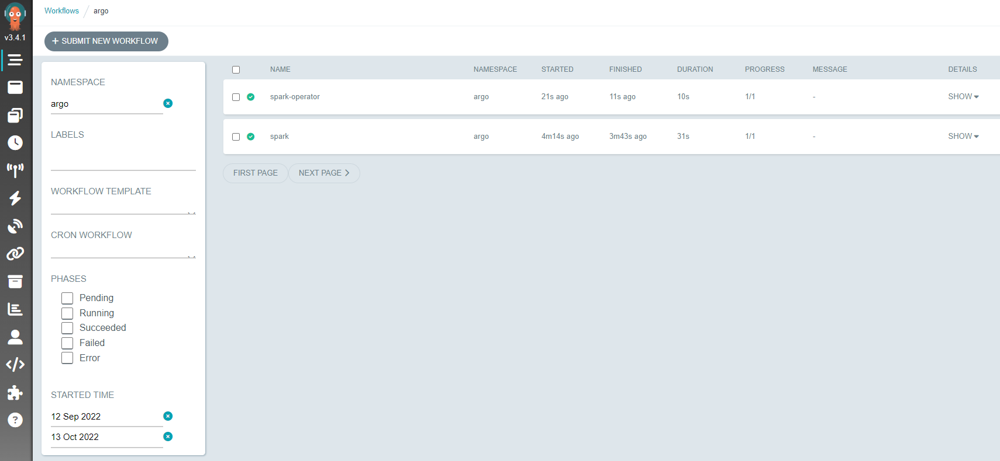

# Argo Workflows on EKS
argo description

The example demonstrates how to use Argo Workflows to assign jobs to Amazon EKS in three ways.
1. Directly create a job and deploy to EKS.
2. spark 
3. spark operator 

## Prerequisites:

Ensure that you have the following tools installed locally:

1. [aws cli](https://docs.aws.amazon.com/cli/latest/userguide/install-cliv2.html)
2. [kubectl](https://Kubernetes.io/docs/tasks/tools/)
3. [terraform](https://learn.hashicorp.com/tutorials/terraform/install-cli)

## Deploy

To provision this example:

```bash
cd data-on-eks/schedulers/argo-workflow
terraform init
terraform apply
```

Enter `yes` at command prompt to apply

The following components are provisioned in your environment:
- A sample VPC, 3 Private Subnets and 3 Public Subnets
- Internet gateway for Public Subnets and NAT Gateway for Private Subnets
- EKS Cluster Control plane with one managed node group
- EKS Managed Add-ons: VPC_CNI, CoreDNS, Kube_Proxy, EBS_CSI_Driver
- K8S metrics server and cluster autoscaler
- A MWAA environment in version 2.2.2
- An EMR virtual cluster registered with the newly created EKS
- A S3 bucket with DAG code

## Validate

The following command will update the `kubeconfig` on your local machine and allow you to interact with your EKS Cluster using `kubectl` to validate the deployment.

1. Run `update-kubeconfig` command:

```bash
aws eks --region <REGION> update-kubeconfig --name <CLUSTER_NAME>
```

2. List the nodes running currently

```bash
kubectl get nodes

# Output should look like below
NAME                                        STATUS   ROLES    AGE   VERSION
ip-10-1-131-99.us-west-2.compute.internal   Ready    <none>   26h   v1.23.9-eks-ba74326
ip-10-1-16-117.us-west-2.compute.internal   Ready    <none>   26h   v1.23.9-eks-ba74326
ip-10-1-80-41.us-west-2.compute.internal    Ready    <none>   26h   v1.23.9-eks-ba74326
```

3. List the namespaces in your EKS cluster
```bash
kubectl get ns

# Output should look like below
NAME              STATUS   AGE
argo              Active   28h
default           Active   30h
kube-node-lease   Active   30h
kube-public       Active   30h
kube-system       Active   30h
spark-operator    Active   30h
yunikorn          Active   30h
```

4. access argo UI/server, kubectl -n argo port-forward deployment.apps/argo-workflows-server 2746:2746
- get login token, argo auth token
Bearer k8s-aws-v1.aHR0cHM6Ly9zdHMudXMtd2VzdC0yLmFtYXpvbmF3cy5jb20vP0FjdGlvbj1HZXRDYWxsZXJJZGVudGl0eSZWZXJzaW9uPTIwMTEtMDYtMTUmWC1BbXotQWxnb3JpdGhtPUFXUzQtSE1BQy1TSEEyNTYmWC1BbXotQ3JlZGVudGlhbD1BS0lBVkNWNFhDV1dLUjZGVTRGMiUyRjIwMjIxMDEzJTJGdXMtd2VzdC0yJTJGc3RzJTJGYXdzNF9yZXF1ZXN0JlgtQW16LURhdGU9MjAyMjEwMTNUMDIyODAyWiZYLUFtei1FeHBpcmVzPTYwJlgtQW16LVNpZ25lZEhlYWRlcnM9aG9zdCUzQngtazhzLWF3cy1pZCZYLUFtei1TaWduYXR1cmU9NmZiNmMxYmQ0MDQyMWIwNTI3NjY4MzZhMGJiNmUzNjg1MTk1YmM0NDQzMjIyMTg5ZDNmZmE1YzJjZmRiMjc4OA


5. deploy argo-spark
kubectl apply -f workflow-example/argo-spark.yaml

kubectl get wf -n argo
NAME    STATUS    AGE   MESSAGE
spark   Running   8s    


5. deploy argo-spark operator
kubectl apply -f workflow-example/argo-spark-operator.yaml 

kubectl get wf -n argo
NAME             STATUS      AGE     MESSAGE
spark            Succeeded   3m58s   
spark-operator   Running     5s      

