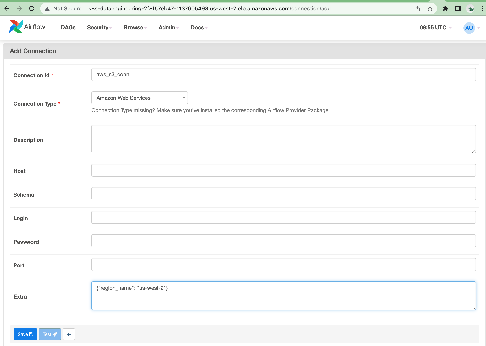

# Self-managed Apache Airflow deployment for EKS

This pattern deploys the production ready **Self-managed [Apache Airflow](https://airflow.apache.org/docs/apache-airflow/stable/)** deployment on EKS.
The following resources created by this example.

- VPC, 3 Private Subnets, 3 Public Subnets for Public ALB, 3 Database Subnets for RDS
- PostgreSQL RDS security group
- Creates EKS Cluster Control plane with public endpoint (for demo purpose only) with one managed node group
- Deploys Managed add-ons vpc_cni, coredns, kube-proxy
- Deploys Self-managed add-ons aws_efs_csi_driver, aws_for_fluentbit, aws_load_balancer_controller, prometheus
- Apache Airflow add-on with production ready Helm configuration
- S3 bucket for Apache Airflow logs and EFS storage class for mounting dags to Airflow pods

## Prerequisites:

Ensure that you have installed the following tools on your machine.

1. [aws cli](https://docs.aws.amazon.com/cli/latest/userguide/install-cliv2.html)
2. [kubectl](https://Kubernetes.io/docs/tasks/tools/)
3. [terraform](https://learn.hashicorp.com/tutorials/terraform/install-cli)

## Deploy

Clone the repository

```bash
git clone https://github.com/awslabs/data-on-eks.git
```

Navigate into one of the example directories and run `terraform init`

```bash
cd schedulers/self-managed-airflow
terraform init
```

Set `AWS_REGION` and Run `terraform plan` to verify the resources created by this execution.

```bash
export AWS_REGION="<enter-your-region>"
terraform plan
```

Deploy the pattern

```bash
terraform apply
```

Enter `yes` to apply.

:::info

Rerun `terraform apply` if your execution timed out.

:::

## Verify the resources

### Create kubectl config

```bash
aws eks --region "<ENTER_REGION>" update-kubeconfig --name "<ENTER_EKS_CLUSTER_ID>"
```

### Describe the EKS Cluster

```bash
aws eks describe-cluster --name self-managed-airflow
```

### Verify the EFS PV and PVC created by this deployment

```bash
kubectl get pvc -n airflow  

NAME           STATUS   VOLUME                                     CAPACITY   ACCESS MODES   STORAGECLASS   AGE
airflow-dags   Bound    pvc-157cc724-06d7-4171-a14d-something   10Gi       RWX            efs-sc         73m

kubectl get pv -n airflow
NAME                                       CAPACITY   ACCESS MODES   RECLAIM POLICY   STATUS   CLAIM                          STORAGECLASS   REASON   AGE
pvc-157cc724-06d7-4171-a14d-something   10Gi       RWX            Delete           Bound    airflow/airflow-dags           efs-sc                  74m

```

### Verify the EFS Filesystem

```bash
aws efs describe-file-systems --query "FileSystems[*].FileSystemId" --output text
```
### Verify S3 bucket created for Airflow logs

```bashell
aws s3 ls | grep airflow-logs-
```

### Verify the Airflow deployment

```bashell
kubectl get deployment -n airflow

NAME                READY   UP-TO-DATE   AVAILABLE   AGE
airflow-pgbouncer   1/1     1            1           77m
airflow-scheduler   2/2     2            2           77m
airflow-statsd      1/1     1            1           77m
airflow-triggerer   1/1     1            1           77m
airflow-webserver   2/2     2            2           77m

```

### Fetch Postgres RDS password

Amazon Postgres RDS database password can be fetched from the Secrets manager

- Login to AWS console and open secrets manager
- Click on `postgres` secret name
- Click on Retrieve secret value button to verify the Postgres DB master password

### Login to Airflow Web UI

This deployment creates an Ingress object with public LoadBalancer(internet-facing) for demo purpose
For production workloads, you can modify `values.yaml` to choose `internal` LB. In addition, it's also recommended to use Route53 for Airflow domain and ACM for generating certificates to access Airflow on HTTPS port.

Execute the following command to get the ALB DNS name

```bashell
kubectl get ingress -n airflow

NAME                      CLASS   HOSTS   ADDRESS                                                                PORTS   AGE
airflow-airflow-ingress   alb     *       k8s-dataengineering-c92bfeb177-randomnumber.us-west-2.elb.amazonaws.com   80      88m

```

The above ALB URL will be different for you deployment. So use your URL and open it in a brower

e.g., Open URL `http://k8s-dataengineering-c92bfeb177-randomnumber.us-west-2.elb.amazonaws.com/` in a browser


By default, Airflow creates a default user with `admin` and password as `admin`

Login with Admin user and password and create new users for Admin and Viewer roles and delete the default admin user

### Create S3 Connection from Airflow Web UI

This step is critical for writing the Airflow logs to S3 bucket.

- Login to Airflow WebUI with `admin` and password as `admin` using ALB URL
- Select `Admin` dropdown and Click on `Connections`
- Click on "+" button to add a new record
- Enter Connection Id as `aws_s3_conn`, Connection Type as `Amazon Web Services` and Extra as `{"region_name": "<ENTER_YOUR_REGION>"}`
- Click on Save button



### Execute Sample Airflow Job

- Login to Airflow WebUI
- Click on `DAGs` link on the top of the page. This will show two dags pre-created by the GitSync feature
- Execute the first DAG by clicking on Play button (`>`)
- Verify the DAG execution from `Graph` link
- All the Tasks will go green after few minutes
- Click on one of the green Task which opens a popup with log link where you can verify the logs pointing to S3

## Cleanup
To clean up your environment, destroy the Terraform modules in reverse order.

Destroy the Kubernetes Add-ons, EKS cluster with Node groups and VPC

```bash
terraform destroy -target="module.db" -auto-approve
terraform destroy -target="module.eks_blueprints_kubernetes_addons" -auto-approve
terraform destroy -target="module.eks_blueprints" -auto-approve
```

Finally, destroy any additional resources that are not in the above modules

```bash
terraform destroy -auto-approve
```
Make sure all the S3 buckets are empty and deleted once your test is finished

---
