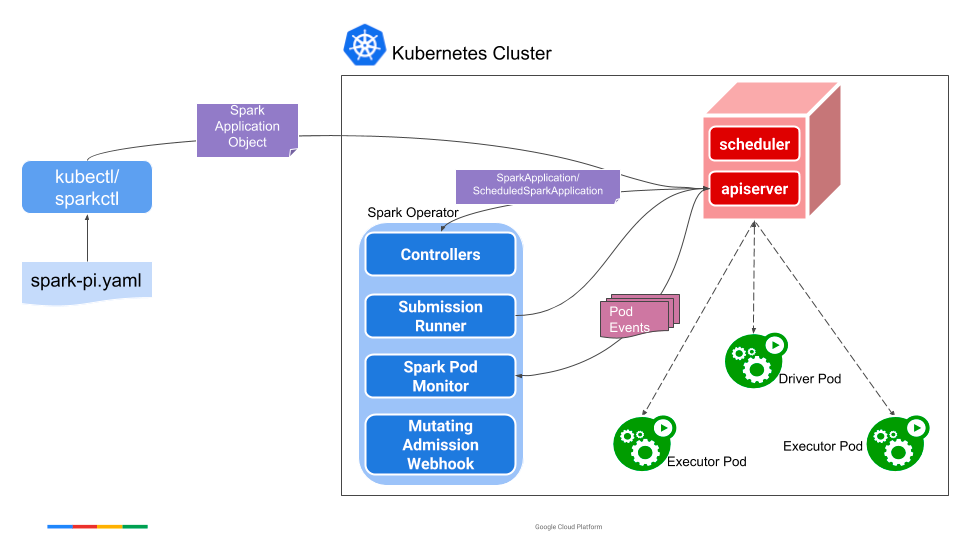

# Running Spark jobs with Spark Operator and YuniKorn

## Introduction
In this post, we will learn to build, configure and deploy highly scalable EKS Cluster with Open source [Spark Operator](https://github.com/GoogleCloudPlatform/spark-on-k8s-operator) and [Apache YuniKorn](https://yunikorn.apache.org/) batch scheduler.

## Spark Operator

The Kubernetes Operator for Apache Spark aims to make specifying and running Spark applications as easy and idiomatic as running other workloads on Kubernetes.

* a SparkApplication controller that watches events of creation, updates, and deletion of SparkApplication objects and acts on the watch events,
* a submission runner that runs spark-submit for submissions received from the controller,
* a Spark pod monitor that watches for Spark pods and sends pod status updates to the controller,
* a Mutating Admission Webhook that handles customizations for Spark driver and executor pods based on the annotations on the pods added by the controller,
* and also a command-line tool named sparkctl for working with the operator.

The following diagram shows how different components of Spark Operator add-pn interact and work together.



## Deploying the Solution

In this [example](https://github.com/awslabs/data-on-eks/tree/main/analytics/terraform/spark-k8s-operator), you will provision the following resources required to run Spark Jobs with open source Spark Operator and Apache YuniKorn.

This example deploys an EKS Cluster running the Spark K8s Operator into a new VPC.

- Creates a new sample VPC, 3 Private Subnets and 3 Public Subnets
- Creates Internet gateway for Public Subnets and NAT Gateway for Private Subnets
- Creates EKS Cluster Control plane with public endpoint (for demo reasons only) with one managed node group
- Deploys Metrics server, Cluster Autoscaler, Spark-k8s-operator, Apache Yunikorn and Prometheus server.
- Spark Operator is a Kubernetes Operator for Apache Spark deployed to `spark-operator` namespace. The operator by default watches and handles `SparkApplications` in all namespaces.

### Prerequisites

Ensure that you have installed the following tools on your machine.

1. [aws cli](https://docs.aws.amazon.com/cli/latest/userguide/install-cliv2.html)
2. [kubectl](https://Kubernetes.io/docs/tasks/tools/)
3. [terraform](https://learn.hashicorp.com/tutorials/terraform/install-cli)

### Deploy

Clone the repository

```bash
git clone https://github.com/awslabs/data-on-eks.git
```

Navigate into one of the example directories and run `terraform init`

```bash
cd analytics/terraform/spark-k8s-operator
terraform init
```

Run Terraform plan to verify the resources created by this execution.

```bash
export AWS_REGION="us-west-2"   # Change according to your needs
terraform plan
```

Deploy the pattern

```bash
terraform apply
```

Enter `yes` to apply.

## Sample Spark Job with Spark Operator

Execute sample PySpark Pi job.

```bash
  cd analytics/terraform/spark-k8s-operator/examples
  kubectl apply -f pyspark-pi-job.yaml
```

Verify the Spark job status

```bash
  kubectl get sparkapplications -n spark-team-a

  kubectl describe sparkapplication pyspark-pi -n spark-team-a
```

## NVMe Ephemeral SSD disk for Spark shuffle storage

Example PySpark job that uses NVMe based ephemeral SSD disk for Driver and Executor shuffle storage

```bash
  cd analytics/terraform/spark-k8s-operator/examples/nvme-ephemeral-storage
```

Update the variables in Shell script and execute

```bash
  ./taxi-trip-execute.sh
```

Update YAML file and run the below command

```bash
  kubectl apply -f nvme-ephemeral-storage.yaml
```

## EBS Dynamic PVC for shuffle storage
Example PySpark job that uses EBS ON_DEMAND volumes using Dynamic PVCs for Driver and Executor shuffle storage

```bash
  cd analytics/terraform/spark-k8s-operator/examples/nvme-ephemeral-storage
```

Update the variables in Shell script and execute

```bash
  ./taxi-trip-execute.sh
```

Update YAML file and run the below command

```bash
  kubectl apply -f nvme-ephemeral-storage.yaml
```

## Apache YuniKorn Gang Scheduling with NVMe based SSD disk for shuffle storage
Gang Scheduling Spark jobs using Apache YuniKorn and Spark Operator

```bash
  cd analytics/terraform/spark-k8s-operator/examples/nvme-yunikorn-gang-scheduling
```

Update the variables in Shell script and execute

```bash
  ./taxi-trip-execute.sh
```

Update YAML file and run the below command

```bash
  kubectl apply -f nvme-yunikorn-gang-scheduling.yaml
```

## Example for TPCDS Benchmark test
Check the pre-requisites in yaml file before running this job.

```bash
cd analytics/terraform/spark-k8s-operator/examples/benchmark
```

Step1: Benchmark test data generation

```bash
kubectl apply -f tpcds-benchmark-data-generation-1t
```
Step2: Execute Benchmark test

```bash
  kubectl apply -f tpcds-benchmark-1t.yaml
```

## Cleanup

To clean up your environment, destroy the Terraform modules in reverse order with `--target` option to avoid destroy failures.

Destroy the Kubernetes Add-ons, EKS cluster with Node groups and VPC

```bash
terraform destroy -target="module.eks_blueprints_kubernetes_addons" -auto-approve
terraform destroy -target="module.eks_blueprints" -auto-approve
terraform destroy -target="module.vpc" -auto-approve
```

Finally, destroy any additional resources that are not in the above modules

```bash
terraform destroy -auto-approve
```
:::caution

To avoid unwanted charges to your AWS account, delete all the AWS resources created during this deployment
:::
